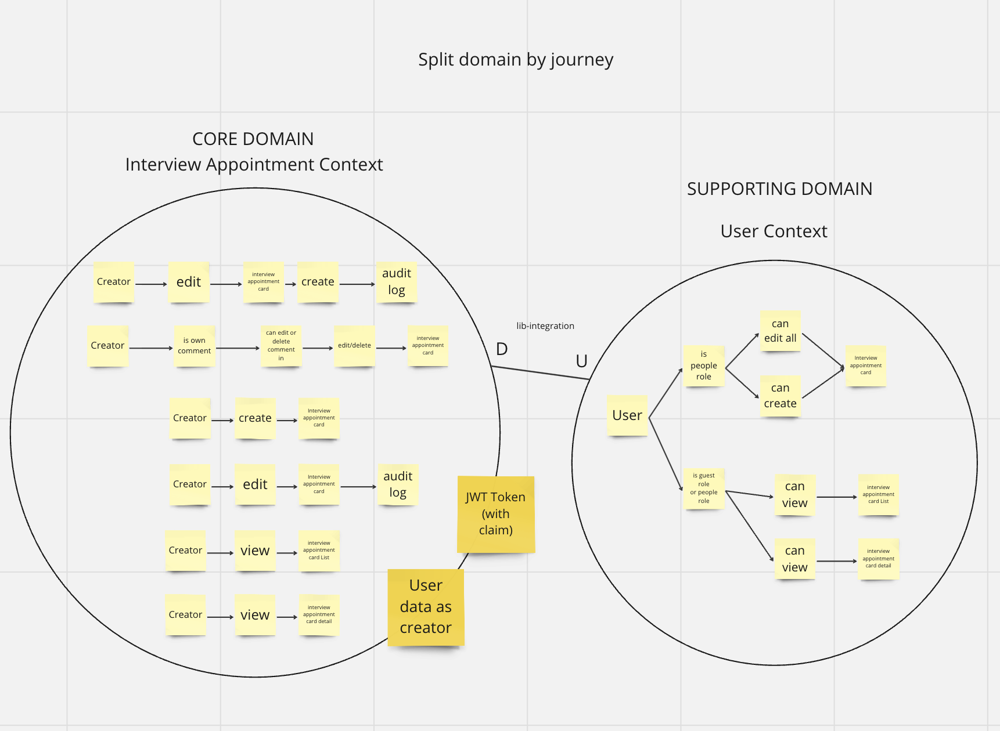

# RBH project

This is the pre-interview project implement with domain-driven-design

## Installation
    go mod download

## Run with docker
    make docker-up

## Down docker
    make docker-down

## Run with environment variable 
    (edit file .env.default and put the database url) (prepare mysql for :3306)

    make run

## Unit-test and Integration-test
    make unit-test
    
    make integration-test-up

## Down the integration-test sandbox
    make integration-test-down

## Improvement
    - write more test for interview-appointment-service and use env library such as viper, Ginkgo to manage env, test.
    - improve dockerfile to more readable.
    - can split relationship between user-service, interview-appointment-service from library interaction to client call.
      to make this 2 domain to microservice.
    - some module in pkg can split to be a share library.
    - add log in service layer.